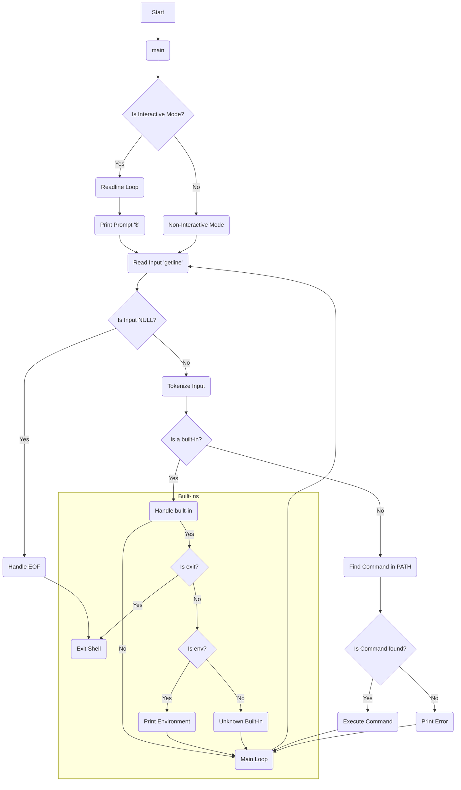

<p align="center">
   
</p>

# 🚀 holbertonschool-simple_shell Project

This project is a custom implementation of a simple UNIX command line interpreter, also known as a shell. It was developed as part of the Holberton School curriculum.

---

## Table of Contents
- [Project Description](#-project-description)
- [Requirements](#-requirements)
- [Flowchart & Snippets](#-flowchart-&-snippets)
- [Features](#-features)
- [Usage](#-usage)
- [Project Structure](#-project-structure)
- [Return](#-return)
- [Authors](#-authors)

---

## 📝 Project Description
This project involves building a basic command-line interpreter that mimics the functionality of a UNIX shell. The shell reads commands from the user, parses them, and executes them using system calls like `fork`, `execve`, and `wait`. The project adheres to strict coding standards, including the Betty style, and is built with a limited set of allowed functions.

---

## ✅ Requirements
### General
- **Allowed Editors**: `vi`, `vim`, `emacs`
- **Compilation Environment**: Ubuntu 20.04 LTS
- **Compiler**: GCC with the flags `-Wall -Werror -Wextra -pedantic -std=gnu89`
- All files must end with a new line.
- The code must follow the Betty coding style.
- No global variables are allowed.
- Each file should have a maximum of 5 functions.
- All function prototypes must be in a header file, which should use include guards.

### ⚙️ Compilation
The shell can be compiled using the following command:
```bash
gcc -Wall -Werror -Wextra -pedantic -std=gnu89 *.c -o hsh
````
### Code Standards
- All files must end with a new line
- Use Betty coding style (checked with `betty-style.pl` and `betty-doc.pl`)
- No global variables allowed
- Maximum of 5 functions per file
- All function prototypes in `main.h`
- Header files must use include guards

### Authorized Functions and System Calls

The project uses a specific set of allowed functions, including those for memory management, process creation, and I/O operations. A comprehensive list can be found in the project's background context. Notable allowed functions include:

  - **`malloc`**, **`free`**: For dynamic memory allocation.
  - **`fork`**, **`execve`**, **`wait`**: For process management.
  - **`read`**, **`write`**: For file I/O.
  - All functions from `<string.h>` are permitted.

-----

## 📊 Flowchart & Snippets

### Flowchart



### Snippets

- Main Function


- Test ls -la command


- Test help & env commands


- Custom _getenv function


- Test Valgrind


-----

## ✨ Features

The simple shell supports several key features of a basic command-line interpreter:

  - **Interactive and Non-Interactive Modes**: The shell works when run from the command line and when commands are piped to it.
  - **Simple Command Execution**: It handles single-word commands and commands with arguments.
  - **PATH Handling**: It can locate and execute commands found within the system's `PATH`.
  - **Built-in Commands**: The shell includes custom implementations of the `exit` and `env` built-in commands.
      - **`exit`**: Terminates the shell.
      - **`env`**: Prints the current environment variables to standard output.
  - **Error Handling**: The shell displays an appropriate error message if a command is not found.
  - **End-of-File Handling**: It handles the `Ctrl+D` (EOF) condition gracefully to exit the shell.

-----

## 💻 Usage

The shell can be used in two primary modes:

### Interactive Mode

When run without any arguments, the shell presents a prompt (`$` by default) and waits for a command to be typed.

```bash
$./hsh$ /bin/ls
hsh main.c shell.c
$ ls -l
total 20
-rwxr-xr-x 1 user user 15000 Aug 21 12:00 hsh
-rw-r--r-- 1 user user  1200 Aug 21 11:55 main.c
-rw-r--r-- 1 user user   800 Aug 21 11:58 shell.c
$ exit
```

### Non-Interactive Mode

The shell can also receive commands through a pipe or input redirection.

```bash
$ echo "/bin/ls" | ./hsh
hsh main.c shell.c
$
```

-----

## 📦 Project Structure

  - [README.md](https://github.com/vtiquet/holbertonschool-printf/blob/main/_printf.c): This file, providing an overview of the project.
  - [man_1_simple_shell.1](https://github.com/vtiquet/holbertonschool-simple_shell/blob/main/man_1_simple_shell.1): A man page for the custom shell.
  - [AUTHORS](https://github.com/vtiquet/holbertonschool-simple_shell/blob/main/AUTHORS): A file listing all contributors to the project.
  - [builtins.c](https://github.com/vtiquet/holbertonschool-simple_shell/blob/main/builtins.c): A file that implement the built-in functionality of the shell.
  - [helpers.c](https://github.com/vtiquet/holbertonschool-simple_shell/blob/main/helpers.c): A file that helps with tokenization of an input.
  - [path_utils.c](https://github.com/vtiquet/holbertonschool-simple_shell/blob/main/path_utils.c): A file that allow the recognition of a command (if built-in)
  - [path_utils.h](https://github.com/vtiquet/holbertonschool-simple_shell/blob/main/path_utils.h): A file containing function prototypes and include guards for the path_utils.c file.
  - [shell.c](https://github.com/vtiquet/holbertonschool-simple_shell/blob/main/shell.c): The main function for the shell.
  - [shell.h](https://github.com/vtiquet/holbertonschool-simple_shell/blob/main/shell.h): A file containing function prototypes and include guards for most of the *.c files.
  
  ---

## ↩ Return

  - 0: For success.
  - 1: For error.
  - 127: If the command doesn't exist.
  - 126: The command exist but is not executable.
  - -1: For error linked to the fork().


-----

## ✍️ Authors
  - **[Mélissa SBIBIH](https://github.com/Schpser)** - Student at Holberton School
  - **[Valentin TIQUET](https://github.com/vtiquet)** - Student at Holberton School
  - **[Yanis LEROY](https://github.com/leroy-yanis)** - Student at Holberton School

